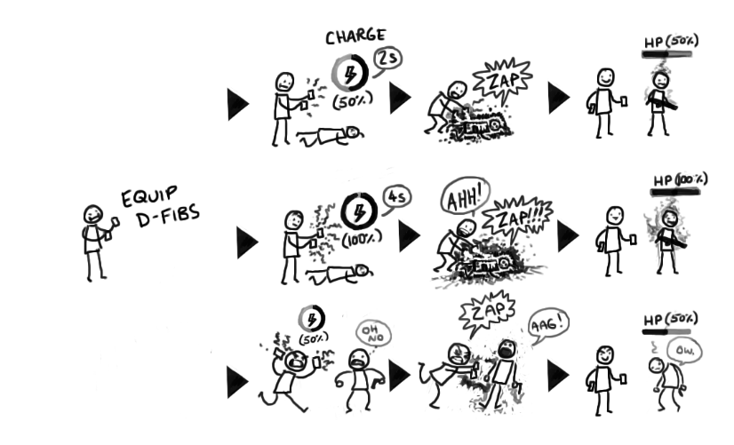
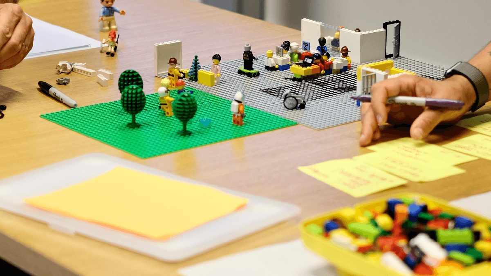
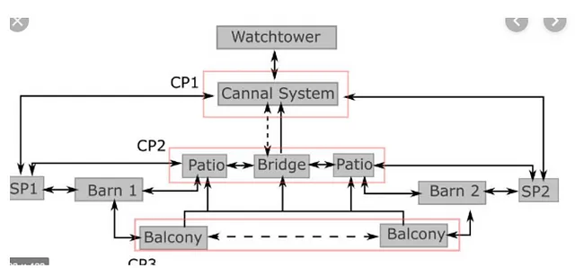
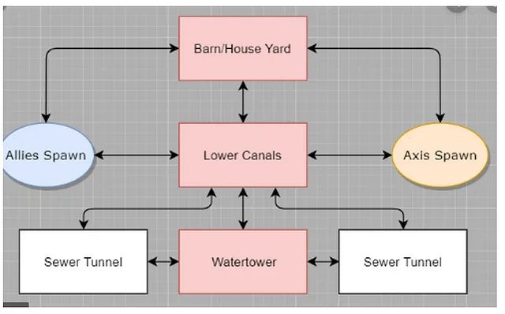

# Week 05 - Level Design 1
Today we will be moving from designing our Challenges to turning these Challenges into encounters, and these encounters into our level. This is part one of a two-part prac, and the lectures for this week and next are similarly related. As such, you may find yourself needing to come back to the tasks here after next week's lecture, and revisiting some of this week's lecture next week. Don't worry too much that your path to greatness isn't totally linear. ;-)

## Notes
### Capturing your design
A big part of these pracs is about capturing your design process in action. Not only will you be marked on your iteration and documentation, but it is also an expectation within industry. Today we are going to be creating some of the level design artefacts proper, so it is important you are storing them in your assignment repo and design document. You may wish to open that file (`DesignDocument.md` in the assignment repo) and edit it as you go.

### Take it easy
This prac is going to involve a lot of different examples of prototyping methods. Some are covered in the Week 5 lecture, and more in Week 6. However, we want to show you the breadth of ways you can use iterative design processes to make your levels. So go easy on yourself. The point isn't for you to try them all, but for you to try enough to find what works for you.

## Tools used
Today's task uses (but is not limited to):

* GitHub Desktop (or your GitHub client of choice)
* Unity
* A prototyping tool of your choice. Some options:
    * PowerPoint
    * [Virtual Graph Paper](https://virtual-graph-paper.com/)
    * [draw.io](https://app.diagrams.net/)
    * [Figma](https://www.figma.com/)
    * Adobe Illustrator
    * Good ol' fashioned pen and paper!

## Assignment deliverable
Today, you will design and prototype encounters for your level. We will be asking you to create prototypes that you must include in your final assignment, so make sure you are recording and storing these artefacts appropriately.

## Understanding our game (5 min)
We are going to start our level design via encounter design, as discussed in this week's lecture.

When crafting your encounters, you want to think of them as <b>units of gameplay</b>. Exactly how this looks in your game will depend on what you are trying to achieve and may even evolve between encounters. Consider and write down:
* Could encounters in this level be single screens, where the player sees all the "pieces" at once?
* Could an encounter be a bigger section of a level, which might involve movement around space with the camera doing the same?
* Could encounters leverage the revealing and hiding of elements, such as having the player move between two areas a couple of times to complete a single encounter?

Level design is about the movement of the player in physical space, so take a moment to think about and write down how the player moves and views space in your game. Write down:

* How does the player get from one location to the next? What is hard/easy about this movement?
* What can the player see? How big a view do they have of the world, and how does this change as they move about?

With these broad understandings of your game and its design in mind, it is time to start designing your first encounters.

## Section 1 Encounters Design (30 min)
You'll likely move back-and-forth between your different sections. However, we're going to start by designing some encounters for section 1, informed by the challenge design work you did last week.

### Reviewing your challenges
Go back and look at the challenges you made last week. Which ones resonated with you? What did you decide to base a lot of your gameplay on? Identify the elements that you need to introduce the player to (remember, this should be <b>all</b> the required features mentioned in the spec, plus any of the optional ones you are introducing).

Consider what the important mechanical elements of these features are, and the related dynamics, that you need to introduce your player to in the first section of your level. Be deliberate here - if you plan on using switches, but you're not allowing the player to shoot them, you don't need to teach them about this mechanic. Additionally, more complex dynamics that come with the further combination of elements don't all need to be showcased here, especially as we want them to discover things themselves through gameplay.

### Storyboarding
Begin crafting an encounter to introduce your player to one or more of these features. In some cases, you will want to introduce a feature in total isolation (such as a moving platform). Other times, it might be necessary and more engaging to introduce two or more at once (such as the acid pit and checkpoint). There are no hard and fast rules here - refer to the design theory presented in this week's lecture to understand how to craft these.

One of the only prescribed forms of prototypes in the assignment is storyboards for these initial encounters. So, start drafting out some storyboards for this encounter. We will be diving into storyboards next week, but for now simply map out a few sketches (either pen and paper, or using some basic drawing tools like those listed above) to show the sequence of events in your encounter: 
* How does the player approach these elements? What do they observe? 
* What are the broad-stroke responses they can make, and what are the consequences? E.g., the player misses the jump and hits the acid pit, so respawns and starts again.

Your storyboards are not meant to be masterful works of art. They should simply be informative as to what the beat-by-beat of this encounter's gameplay looks like.

Don't get too hung up on the spatialisation of this just yet - you want to keep those constraints we mentioned before about movement and what the player can see in mind to stop you from going off the rails, but you will be working out the details later. 

You can find an example of a storyboard here, depicting the sequence of using a defibrator in the game <i>Dirty Bomb</i> (Image source: https://www.dirtybomb.com/news/the-design-of-dirty-bomb/):

Try to create two-three different encounters. You'll be coming back to this later in your design process (probably outside of class!), so let's not get too locked-in here.

## Section 2 Encounters Design (30 min)
It's now time to repeat your encounter design process, but instead for Section 2 of your level. These encounters will be a bit different: we can assume players have completed section 1, and are now more familiar with the mechanics, so it is time to introduce some more interesting challenges for them to sink their teeth into.

### Using your challenges
As you spent last week's class exploring different types of challenges, you will now have an idea as to what you want them to look like in your level. See which challenges from your test scenes (or other notes) can be turned into encounters. 

Try drafting another two-three encounters for Section 2 of your level.

### Other prototype methods
While we ask for storyboards for all the encounters where the player is introduced to the different elements, this is the only section where we prescribe this method of prototyping.

There are many ways to prototype encounters. Don't be afraid to experiment. Some ideas:
* Short paragraphs that tell the "narrative" of the encounter. Maybe put together in a tool like [Twine](https://twinery.org), or simply written on pieces of paper.
* Greyboxed encounters in a test scene that show the layout of an encounter but aren't specific about exact geometry.
* Annotated screenshots where a still of the encounter has been created, then drawn over with arrows and notes to indicate movement, etc.
* "Lego" prototypes that use blocks, toys or other physical objects to map out an encounter. The image below shows an example of this (source: https://www.workshopper.com/post/design-thinking-phase-4-everything-you-need-to-know-about-prototyping)

## Molecule Diagram (30 min)
At this stage, you should have 4-6 different encounters. It's time to "zoom out" on your design and consider your level from a topological perspective. 

The topological view of your level is concerned with the general arrangement of the different encounters in your level, and often is done in a "molecule diagram" or another node-based format. 

When working with a topological view of your game, the key here is being able to step back and look at how your player moves through (and sees) your level via the arrangement of your encounters. As such, we recommend prototyping this using something easily modifiable. Nodes in PowerPoint, [Figma](https://www.figma.com/) or [draw.io](https://app.diagrams.net/) are handy. Or sticky notes if you've got a big enough wall and some thread to create links between them!

Your topological view should illustrate how a player gets from one point to another without worrying about the specifics. E.g., it should illustrate they have to move down along a winding path, but not the actual structure of that path. Here are some examples from former Ubisoft developer Iuliu-Cosmin Oniscu (source: https://iuliu-cosmin-oniscu.medium.com/molecule-design-439194cc82bf)

Remember, the player should be introduced to all the features in Section 1 before being tested on them in Section 2. So, while we do want some non-linearity, you really want to consider how you get players out of Section 1 and into the wilds of Section 2 and eventually Section 3. Hint: we say something about this in the week 4 lecture.

## Iteration and connectivity (Until end)

By now, you've got a pretty good picture of how some of your level is going to hang together. You've identified some encounters, and in creating your molecule diagram possibly refined them. Continue your design work being guided by the following provocations:

<b>Iteration</b> 
Now that you have your design in both a micro (encounters) and macro (topology) view, is it working? What could be changed? Do the encounters need re-arranging, or are further tweaks needed here? Don't be afraid to "zoom in and out" on your design by going back and forth between modifying encounters and changing their place in the big picture.

<b>Connectivity</b> 
So far, we've focused on the encounters that are teaching and challenging the player. What about everything in between? Are there opportunities for the player to stop and look out upon the world? Can they see upcoming challenges as they travel by them on a moving platform? Are there examples of both positive and negative space throughout your design? Start thinking about these kinds of encounters and how they might fit into your level to modulate your dramatic arc.

<b>Section 3</b> 
You might want to think a little about Section 3. Sometimes it can be a good idea to have a rough idea of the whole picture and where you want the player to end up.

## Next Week
Next week we will work on moving to the geometry of our level, mapping out exactly what the level looks like both on paper and in engine.