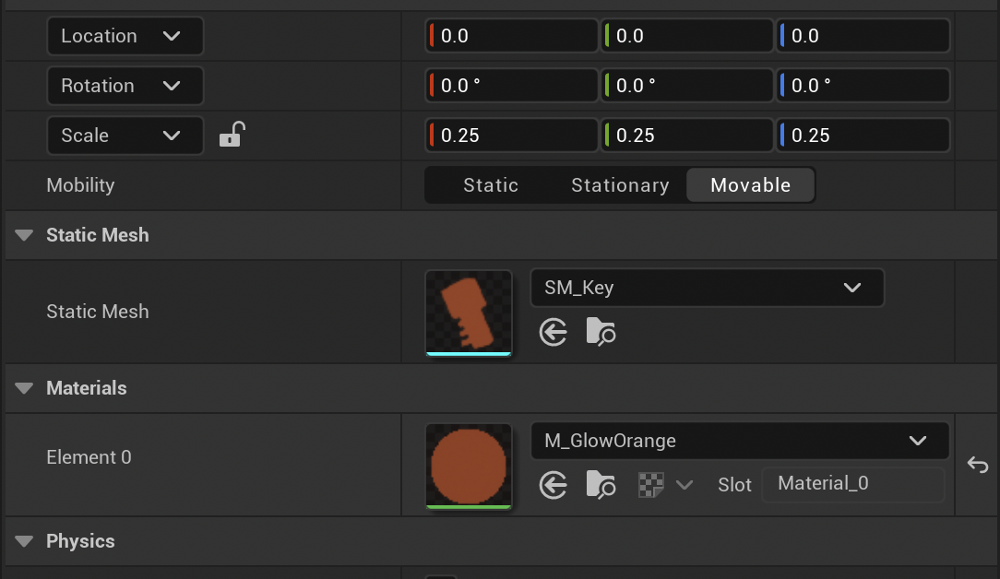
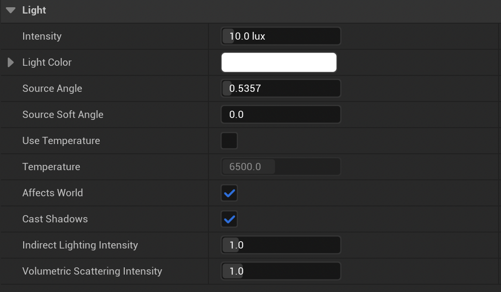

# Week 05 - Level Design 2
In today's prac, we are continuing our work on level design, creating further artefacts and iterations of our level. This is the second last prac before your assignment is due, so you'll want to ensure you have something ready for testing and polishing next prac. Remember that the assumption is you are also working on your assignment outside of class.

More than ever, the timings presented here are indicative. You are now at a stage where we have given you all the tools for good level design, and trust your ability to go forth and build. Follow this lesson plan to ensure you are hitting your goals, but don't worry if you end up lingering on one area for longer.

## Tools used
Today's task uses (but is not limited to):
* GitHub Desktop (or your GitHub client of choice)
* Unreal Engine
* Whatever prototyping tools you want!
  
## Assignment deliverable
Today, you will be creating a geometric prototype of your level, as well as completing the final section of the level. Don't worry if you don't get it all perfect - the idea is to have fully-sketched out your level by the end of today so you can work on further iteration.

## Section 3 (30 min)
Depending on how you went last week, you might already have the plans for Level 3. If not, now is a good time to work on this section.

Go through the steps of encounter prototyping from last week. You should now have a bit of a better idea about the kind of prototyping that works for you, but may also want to experiment a bit more.

Whatever you do, <b>Make sure you are capturing your prototypes</b>. The highest marks for this assignment require multiple prototypes, and these can also all potentially be a case study for your Design & UX Journal Task.

## Revisiting Topology (10 min)
Have another look at your molecule diagrams from last week. Do you still think they hold up? Is there anything you would change now that you've had a bit of time to think about it all? Do a sanity check and spend a bit more time on this before moving on.

## Level Geometry (20 min)
With all your sections constructed, it's time to build a geometry layer prototype. The geometry layer, as discussed in the lecture, is all about how the level fits together. Perhaps the most technical of all prototypes, this is where we need to consider the precise layout and arrangement of objects in our level. Depending on your workflow thus far, your process here might look different. However, we recommend having a go at a variety of methods while here in class, so that you can best find your grove.

Some steps you might take:

#### Annotated Level Map
Annotated level maps are drawn (by hand or using a drawing program) to scale, showing the layout of the level in a far more practical sense. Using grid paper or something else with defined dimensions for scale is important.

#### Lego/Building Blocks
While we don't have Lego in class, this could be a method you experiment with at home. The idea here is that you are creating a physical representation of your level with defined dimensions. Although the level we are creating is 2D, seeing it from another angle can be an important part of design. Using blocks like Lego also gives great flexibility for reconfiguring your level as you work out the specifics.

#### Greyboxes
You might be comfortable (and ready) to just build this in engine. If you do so, make sure you are still zooming right out and thinking about the flow of your level every now and then. Playing it is a great move, but you also want to see how things hang together on a macro scale.

### Questions to ask
Regardless of your approach (or approaches), ask yourself:
* Is my level fully navigable? Can the player soft-lock themselves anywhere, or are there parts that they simply can't get to?
    * If there is a section that is locked off after a certain time, is this a deliberate part of the experience?
* Does my level encourage exploration? Are there loop-backs, hidden paths or anything else like it?
* Does the player need to clear all of Section 1 before moving on? If not, can they accidentally stumble into an encounter where they must use mechanics they haven't been taught about yet?
* Are connective spaces present and well designed, or are they just long-slogs with nothing to do?
* Is there enough in terms of both challenge and recovery for the player? When do they catch their breath and soak in the world?

Be brutal about your level and how it fits together.

## Materials and lighting (30 min)
While the aesthetic design of a level is a whole job in and of itself, some consideration to the lighting and materials in your level will help you make sure you are guiding (or distracting) your player in the ways you want.

### Materials
In order to make sure your level is compatible with the whole Cryoshock project, you are not to make new materials for this assignment. However, in the COMP2150 > Generic folder, you'll find all the materials used in the project, as well as some additional ones. These materials will allow you to add matte colours, glowing lights, or change certain walls, etc. see-through.

To change the material on an object, select its mesh in the outliner (generally a child object), and scroll down to the "Materials" tab. You can then drag-and-drop different materials, or change them from the drop-down menu. Experiment with how different materials change the mood of the game and what they communicate to the player about where to go and what to do.

### Lighting
Lighting is not only important for guiding your player, but also just allowing them to see what's going on. The scene has been set-up with a directional light, which acts as a sort of sun light object.  However, if you are going to be making closed off areas, you'll probably need to start introducing more lights (a tunnel, for instance, will quickly become very dark!). 

To place lights in your scene, press the Add button (Cube with a green plus), then scroll to Lights and select from the list. A deep dive into lighting types is for another time, but as a quick guide:

<b>Direction Light:</b> Acts as a sort of sunlight, projecting light into the scene from a particular direction. You generally don't want too many of these (one is standard, two is extra).

<b>Point Light:</b> Emits light in all directions, but from a particular point. Useful for lamps, etc.

<b>Spotlight:</b> Projects light against a surface from a single point, like an electric torch.

<b>Rect Light:</b> Emits light volumetrically within a shape. Useful for lighting large areas uniformally.

When you cretae a light, there are a number of properties such as colour and intensity you can modify. It can be a bit overwhelming, but we recommend playing with both intensity and colour, and seeing what kind of moods you can create.

Importantly, however, lighting can quickly get out of hand, especially with Unreal's additivel ighting approach. Place lights deliberately and try to use as few lights as possible.

Note that there is no assignment specification around lighting and materials specifically. We will not be evaluating your artistic skills in this way. However, we will be looking generally at how well your level communicates to the player what they need to do and creates an engaging experience, and some manipulation of lighting and materials may be a part of that.

## Playtesting nad back and forth prototyping (Until end)
In the remaining time, swap around with other students and play each other's games. Pay careful attention to how other players move about your level - are they progressing the way you planned? Are any hidden sections or alternative routes being ignored? Does the level seem to nicely guide the player through each section with room for exploration?

You want to think about the following questions for your level:
* Is there a natural path through the level? Is this the journey I want the player to go on, or are they missing things?
* Do my encounters nicely build on one another? Is the player ever put in a situation where they might not know what to do/how to progress?
* Are there any unintended challenges due to quirks in my level design? E.g., a jump that is supposed to just get from one part of the map to another is difficult because of the platforms around it. How do I fix this?
* Is the difficulty in my level providing an appropriate level of challenge, or is it "difficult for the sake of it"?
* Does my level encourage the player to explore? Can I include some more secrets, or a couple of alternative routes? How might I incentivise the player to take these routes (items, more challenges, shortcuts, etc)?
* Does my level give the player opportunities for discovery? Do I tell them everything, or let them try things out and see what happens?

Don't be afraid to move back-and-forth between prototypes as you go. Find a workflow and rhythm that works for you!

## Next Week
Next week will be your final week on the level design task before submission. We will be spending class wrapping up our work, getting some last-minute feedback, and polishing our documentation. See you then!